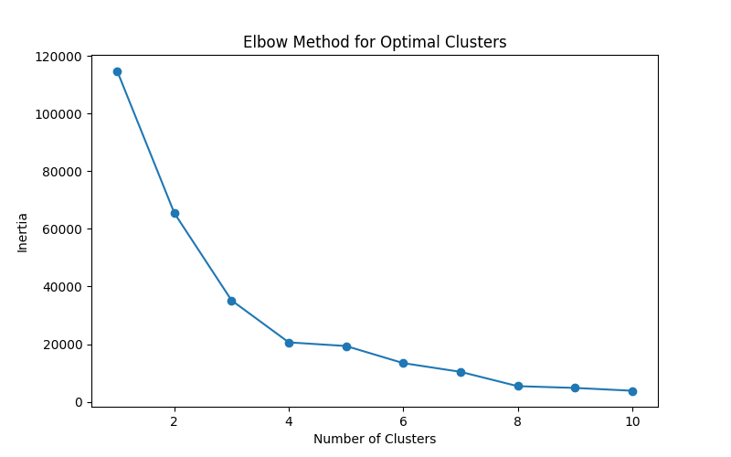
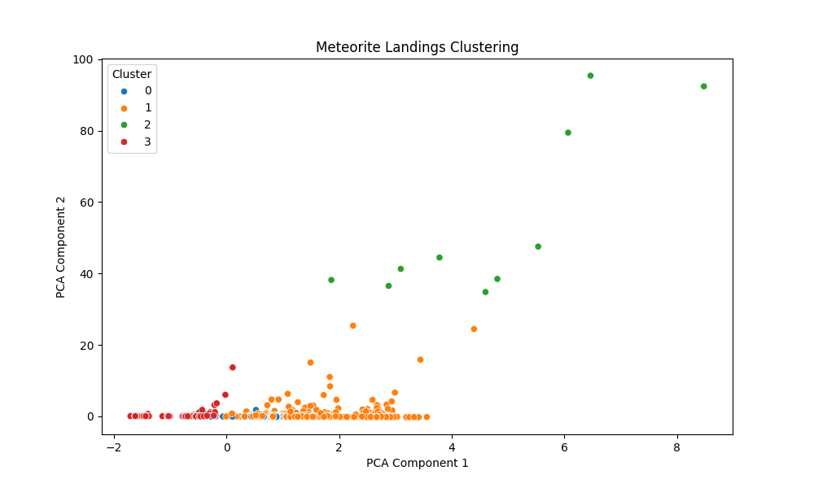
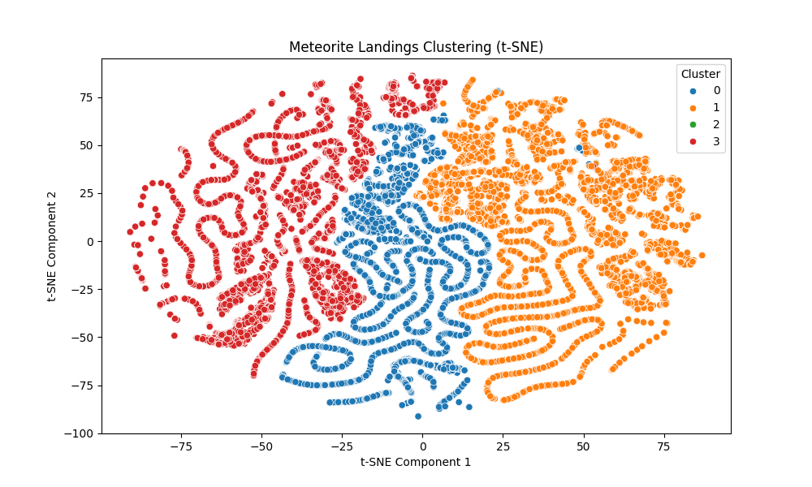

# Meteorite Landings Clustering Analysis

This project explores the NASA Meteorite Landings dataset by applying clustering techniques to uncover natural groupings based on mass and geographic distribution. The goal was to identify meaningful trends that provide insights into meteorite recovery efforts and historical meteorite falls.

## Dataset Description
The dataset used in this project is the NASA Meteorite Landings dataset, which contains data about ~45,000 meteorites.

For this analysis, the following features were selected:
- `mass`: Meteorite mass (grams).
- `reclat`: Latitude of the landing.
- `reclong`: Longitude of the landing.

## Methodology
1. **Data preprocessing**:
    - Missing values were handled.
    - Features were normalized for clustering.
2. **Clustering Algorithm**:
    - K-Means clustering was applied.
    - The optimal number of clusters was determined using the Elbow Method.
3. **Evaluation**:
    - Clustering quality was evaluated using the silhouette score.
4. **Visualization**:
    - Dimensionality reduction techniques (PCA and t-SNE) were used visualize clusters.

## Results
### Cluster Summary
| Cluster | Avg. Mass (g)   | Avg. Latitude | Avg. Longitude |
|---------|-----------------|---------------|----------------|
| 0       | 540             | -73.53        | 28.32          |
| 1       | 13,910          | 14.39         | 2.68           |
| 2       | 34,550,000      | 15.42         | -6.34          |
| 3       | 2,402           | -77.75        | 160.05         |

### Key Insights
- **Cluster 0 (Small Antarctic Meteorites):**
    - Smallest meteorites (~540 g on average).
    - Found in Antarctic regions (`reclat` ~ -73.53).

- **Cluster 1 (Moderate Mass, Warmer Regions):**
    - Moderate-sized meteorites (~13,910 g).
    - Found in warmer regions near the equator (`reclat` ~ 14.39).

- **Cluster 2 (Large Historic Meteorites):**
    - Exceptionally large meteorites (~34.55 million g).
    - Found near the equator (`reclat` ~ 15.42).

- **Cluster 3 (Larger Antarctic Meteorites):**
    - Slightly larger meteorites (~2,402 g) than Cluster 0.
    - Found in Antarctica (`reclat` ~ -77.75).

### Evaluation Metrics
#### Silhouette Score
- Achieved a silhouette score of ~0.70 with 4 clusters, confirming well-defined and meaningful groupings.

#### Elbow Analysis
- Used the Elbow Method to select the optimal number of clusters:
    - The elbow point was identified at 4 clusters.
    - The graph below shows the drop in inertia, highlighting 4 clusters as the best trade-off between simplicity and performance.


### Visualizations
The PCA and t-SNE visualizations highlight clear distinctions between clusters, particularly for larger historic meteorites (Cluster 2) and Antarctic meteorites (Clusters 0 and 3).

#### PCA

#### t-SNE


## Technical Highlights
- **Tools**:
    - Python, pandas, scikit-learn, matplotlib, seaborn.
- **Techniques**:
    - K-Means clustering with optimal cluster selection using the Elbow Method.
    - PCA and t-SNE for dimensionality reduction.
    - Silhouette scoring for cluster quality evaluation.

## How to Run
First, clone the repository to your local machine.

```bash
git clone https://github.com/your-username/funds-portfolio-monitor.git
cd funds-portfolio-monitor
```
### 2. Install Dependencies
Install the required dependencies using `pip`.

```bash
pip install -r requirements.txt
```
The `requirements.txt` file includes all necessary packages, such as:
- `numpy`
- `pandas`
- `matplotlib`
- `yfinance`
- `scikit-learn`
- `tensorflow`

## Usage

### 1. Clone the repository
```bash
git clone <https://github.com/Federico-gvgv/meteorite-clustering>
cd meteorite-clustering
```
### 2. Install the required dependencies
```bash
pip install -r requirements.txt
```

### 3. Run the project
```bash
python main.py
```

Results will be saved in the `results/` folder, cluster summaries will be displayed in the terminal.

## References

- [NASA Meteorite Landings Dataset](https://www.kaggle.com/datasets/nasa/meteorite-landings)